# Malay Language Lexicon - Data Engineering Pipeline

## Project Summary

This project is a comprehensive, end-to-end data engineering pipeline designed to build, enrich, and analyze a large-scale Malay language lexicon. The system automatically sources unstructured text data from the web, processes it at scale using modern data platforms, enriches it with semantic information using generative AI, and stores it in a structured knowledge graph for analysis.

The final result is a lexicon of over 10,000 unique words, complete with definitions, synonyms, antonyms, and sentiment scores, all stored and modeled in a way that captures the rich relationships between words.

## Key Technologies

## Data Storage and Processing

### Data Collection and Raw Storage
- **What to Store**: Raw scraped text data.
- **Where to Store**: Hadoop HDFS.
- **Tool**: PySpark for ingestion and Hadoop for storage.

### Processed Data
- **What to Store**: Cleaned and tokenized text.
- **Where to Store**: Hadoop HDFS or a relational database.
- **Tool**: PySpark for preprocessing.

### Lexicon
- **What to Store**: Words with definitions, relationships, and POS annotations.
- **Where to Store**: Neo4j for relationships; Redis for fast retrieval.
- **Tool**: Neo4j and Redis.

### Analytics
- **What to Store**: Analytical results.
- **Where to Store**: Local files, Neo4j, and Redis.
- **Tool**: Neo4j.

### Real-Time Updates
- **What to Store**: New and updated words.
- **Where to Store**: Kafka for message streaming.
- **Tool**: Kafka and Spark Structured Streaming.

## Decision Highlights
- **Neo4j**: For storing and querying word relationships.
- **Redis**: For fast key-value lookups.
- **Hadoop HDFS**: For scalable storage of raw and processed data.

## System Architecture

The pipeline is designed with a clear separation of concerns, ensuring scalability, reliability, and maintainability.

```graphviz
digraph "Data Engineering Pipeline" {
    rankdir="LR";
    splines=ortho;
    node [shape=box, style="rounded,filled", fontname="Helvetica"];

    subgraph cluster_0 {
        label="1. Data Ingestion";
        bgcolor="#E3F2FD";
        node [fillcolor="#BBDEFB"];
        web_forum [label="Web Forum\n(cari.com.my)", shape=cylinder];
        wikipedia [label="Wikipedia API", shape=cylinder];
        scraper [label="ForumScraper.py"];
        wiki_utils [label="UtilsWikipedia.py"];
    }

    subgraph cluster_1 {
        label="2. Real-time Streaming";
        bgcolor="#E8F5E9";
        node [fillcolor="#C8E6C9"];
        kafka_producer [label="Kafka Producer\n(kafka_producer_show.py)"];
        kafka_topic [label="Kafka Topic\n(wiki_topic)", shape=cds];
    }

    subgraph cluster_2 {
        label="3. Distributed Processing & Cleaning";
        bgcolor="#FFF3E0";
        node [fillcolor="#FFE0B2"];
        pyspark_consumer [label="PySpark Consumer\n(kafka_consumer_show.py)"];
        pyspark_processor [label="PySpark Processor\n(UtilsProcessor.py, UtilsCleaner.py)"];
        pyspark_global [label="GlobalSparkSession.py", shape=component];
    }

    subgraph cluster_3 {
        label="4. AI-Powered Enrichment";
        bgcolor="#F3E5F5";
        node [fillcolor="#E1BEE7"];
        word_gen [label="WordDetailsGenerator.py"];
        gemini_api [label="Google Gemini API", shape=cloud];
    }

    subgraph cluster_4 {
        label="5. Structured Storage & Modeling";
        bgcolor="#FFEBEE";
        node [fillcolor="#FFCDD2"];
        neo4j [label="Neo4j Graph DB\n(Word Relationships)", shape=cylinder];
        redis [label="Redis Cache\n(Analytics & Frequencies)", shape=cylinder];
        db_handler [label="UtilsNeo4j.py"];
        redis_utils [label="UtilsRedis.py"];
    }

    subgraph cluster_5 {
        label="6. Analysis & Maintenance";
        bgcolor="#E0F7FA";
        node [fillcolor="#B2EBF2"];
        notebook [label="Jupyter Notebooks\n(Analysis, Updates)", shape=note];
    }

    // Connections
    web_forum -> scraper;
    wikipedia -> wiki_utils -> kafka_producer -> kafka_topic;
    scraper -> pyspark_processor;
    kafka_topic -> pyspark_consumer -> pyspark_processor;
    pyspark_processor -> word_gen -> gemini_api -> word_gen;
    word_gen -> db_handler;
    word_gen -> redis_utils;
    db_handler -> neo4j;
    redis_utils -> redis;
    notebook -> neo4j;
    notebook -> redis;
}
```

## Pipeline Stages Explained

The project executes in a sequence of well-defined stages:

### Stage 1: Data Ingestion

*   **Objective:** Gather raw, unstructured text data from diverse sources on the web.
*   **Implementation:**
    *   `ForumScraper.py`: A custom-built scraper using `requests` and `BeautifulSoup` to extract article content and user comments from a live web forum. This demonstrates handling of complex, messy HTML.
    *   `UtilsWikipedia.py`: A utility that connects to the Wikipedia API to fetch article titles and content, showing proficiency in API integration.

### Stage 2: Real-time Streaming with Kafka

*   **Objective:** Create a scalable, fault-tolerant message queue to handle incoming data streams, decoupling the ingestion process from the processing system.
*   **Implementation:**
    *   `kafka_producer_show.py`: The Wikipedia data is published as messages to a Kafka topic named `wiki_topic`.
    *   `kafka_consumer_show.py`: A PySpark streaming job subscribes to this topic, allowing for real-time data processing as it arrives.
    *   **Why Kafka?** This choice demonstrates an understanding of modern data architecture. It prevents data loss and allows the processing cluster to consume data at its own pace without overwhelming the data sources.

### Stage 3: Distributed Processing with PySpark

*   **Objective:** Process large volumes of text data efficiently, clean it, and extract a unique vocabulary.
*   **Implementation:**
    *   The core of the processing logic resides in `UtilsProcessor.py` and `UtilsCleaner.py`, orchestrated by the `scrape_articles_into_words.ipynb` notebook.
    *   Data from both the forum scraper and the Kafka stream (Wikipedia) are loaded into Spark DataFrames.
    *   Native PySpark functions (`split`, `explode`, `regexp_replace`) are used for high-performance text cleaning, tokenization, and deduplication, ultimately producing a list of distinct words.
    *   **Why PySpark?** This shows the ability to work with industry-standard tools for big data processing, capable of scaling horizontally across a cluster.

### Stage 4: AI-Powered Semantic Enrichment

*   **Objective:** Go beyond simple word lists by enriching each unique word with deep semantic properties.
*   **Implementation:**
    *   `WordDetailsGenerator.py` takes batches of cleaned words and sends them to the **Google Gemini Pro API** with a carefully engineered prompt.
    *   The prompt instructs the model to act as a linguistic expert, returning a structured CSV response containing the word's definition, an antonym, a synonym, its part of speech (`tatabahasa`), and a sentiment score from -1.0 to 1.0.

### Stage 5: Structured Storage

*   **Objective:** Store the enriched data in databases that are optimized for their specific use cases, rather than a monolithic solution.
*   **Implementation:**
    *   **Neo4j (Graph Database):** `UtilsNeo4j.py` is used to populate a graph database. This is a key architectural decision. Words are stored as `(:Word)` nodes. The synonyms and antonyms generated by the AI are used to create `[:SYNONYM]` and `[:ANTONYM]` relationships between these nodes. This builds a powerful knowledge graph that models semantic relationships directly.
    *   **Redis (In-Memory Cache):** `UtilsRedis.py` is used to store high-access, analytical data. Word frequencies and sentiment score distributions are stored in Redis hashes for near-instant retrieval, which is far more efficient than querying the main database for every analytical request.

### Stage 6: Analysis and Maintenance

*   **Objective:** Analyze the final lexicon and perform data maintenance tasks.
*   **Implementation:**
    *   Jupyter Notebooks (`bryan-extra-indi-pyspark.ipynb`, `insert_missing_word_props.ipynb`) are used as the control plane.
    *   **Analysis:** Cypher queries are run against Neo4j to analyze the semantic network, such as identifying clusters of related words. The word frequency data from Redis is analyzed to find the most and least common words.
    *   **Maintenance:** A dedicated notebook (`insert_missing_word_props.ipynb`) identifies nodes in Neo4j that are missing properties and re-runs them through the Gemini enrichment pipeline, demonstrating a full data lifecycle management approach.

## Data Flow Example

1.  **Input:** A raw, cleaned word from the PySpark job.
    *   `"gembira"`

2.  **AI Enrichment (`WordDetailsGenerator.py` -> Gemini API):** The system generates a structured data record.
    *   `"gembira","rasa senang hati atau bahagia","sedih","ceria","kata sifat","0.9"`

3.  **Graph Modeling (`UtilsNeo4j.py` -> Neo4j):** The data is used to create and connect nodes in the graph.
    *   `MERGE (w:Word {word: "gembira", definition: "...", ...})`
    *   `MERGE (s:Word {word: "ceria"})`
    *   `MERGE (w)-[:SYNONYM]->(s)`

4.  **Analytics Caching (`UtilsRedis.py` -> Redis):** Frequency and sentiment data are cached for fast access.
    *   `HINCRBY word:frequencies gembira 1`
    *   `HSET sentiment:gembira sentiment 0.9`

---